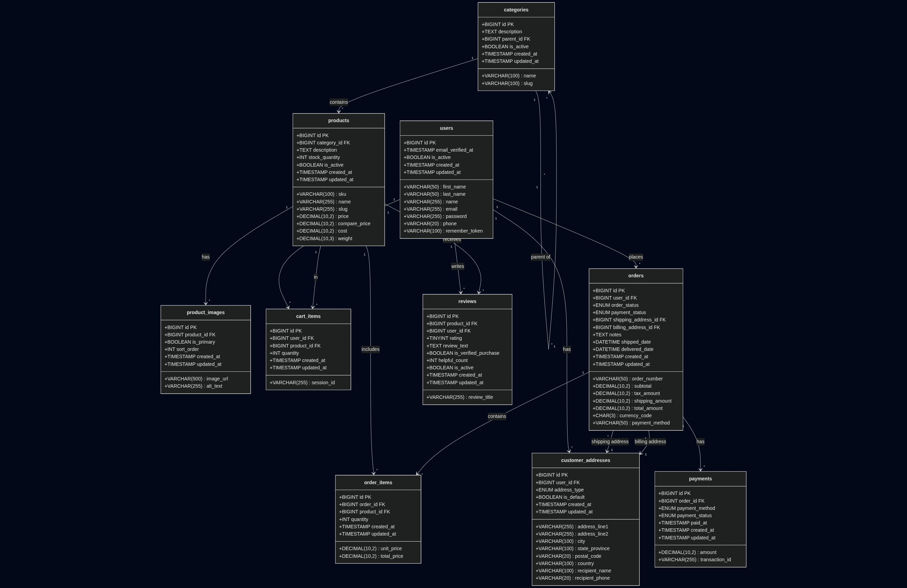

# 🛍️ E-Commerce Platform - Laravel + React

> A full-featured e-commerce platform built with Laravel 10 and React, demonstrating MVC architecture, RESTful API design, and modern web development practices with complete admin dashboard.

---

## 🎯 About The Project

This is a college project showcasing a complete e-commerce platform built using **Laravel framework** with **React frontend** and **MVC architecture**. The project demonstrates understanding of:

- ✅ Model-View-Controller (MVC) design pattern
- ✅ RESTful API development
- ✅ Database relationships and migrations
- ✅ Authentication & Authorization (Laravel Breeze)
- ✅ Modern PHP frameworks with React SPA
- ✅ Admin Dashboard with full CRUD operations
- ✅ Image upload and management
- ✅ Clean code practices with extensive documentation

### **Learning Journey**

This is the framework-based version of my e-commerce project. I also currently building a [vanilla PHP version](https://github.com/Saad05-dev/ecommerce-project-vanilla-php) to understand core concepts before using frameworks.

---

## 📋 Project Overview

### Core Features

#### Customer-Facing Features
- **User Management** - Registration, login, and profile management
- **Product Catalog** - Browse products with categories and search
- **Shopping Cart** - Works for both guests (session) and authenticated users
- **Order System** - Complete order processing and tracking
- **Reviews & Ratings** - Customers can rate and review products
- **Address Management** - Shipping and billing addresses

#### Admin Dashboard Features
- **Statistics Overview** - Total products, revenue, orders, and low stock alerts
- **Product Management** - Full CRUD operations with image upload
  - Add, edit, delete products
  - Image upload with preview
  - Stock management with color-coded alerts
  - Search by name or SKU
  - Filter by category and stock status
- **Category Management** - Full CRUD operations
  - Add, edit, delete categories
  - View products count per category
  - Active/inactive status management
- **Responsive Design** - Works on desktop, tablet, and mobile

### Use Cases

| Actor | Action |
|-------|--------|
| 👤 Visitor | Can browse products without an account |
| 📝 User | Can register and create a profile |
| 🛒 Customer | Can add products to cart |
| 📦 Customer | Can place orders and track status |
| ⭐ Customer | Can leave reviews on purchased products |
| 👨‍💼 Admin | Can manage products, categories, and view statistics |
| 👨‍💼 Admin | Can upload product images and manage inventory |

### Database Schema

The database follows a relational model with the following main entities:


**Main Tables:**
- `users` - Customer and admin accounts (with `is_admin` flag)
- `products` - Product catalog with SKU, pricing, stock
- `categories` - Product categories with hierarchical support
- `product_images` - Multiple images per product with primary flag
- `orders` - Order processing and tracking
- `order_items` - Individual items in each order
- `cart_items` - Shopping cart (guest and user)
- `customer_addresses` - Shipping and billing addresses
- `reviews` - Product reviews and ratings
- `payments` - Payment transaction records

**Database:** The project uses SQLite, a lightweight file-based database stored in `database/database.sqlite`. This makes it easy to set up and portable without requiring a separate database server.

> *See full SQL schema in [`database/sql/laravel_ecommerce.sql`](database/sql/laravel_ecommerce.sql)

### Class Diagram



---

## 🛠️ Tech Stack

### Backend
- **Framework:** Laravel 10.x
- **Language:** PHP 8.1+
- **Database:** SQLite (Lightweight, file-based database)
- **Authentication:** Laravel Breeze with React
- **ORM:** Eloquent
- **File Storage:** Laravel Storage with Symbolic Links

### Frontend
- **Framework:** React 18.x with Hooks (useState, useEffect)
- **Build Tool:** Vite
- **CSS Framework:** Tailwind CSS 3.x
- **HTTP Client:** Fetch API
- **Routing:** Inertia.js (Server-side routing with React)
- **State Management:** React Hooks (local component state)
- **UI Components:** Recharts (for charts), Lucide React (for icons)

### Tools & Services
- **Package Manager:** Composer (PHP) & npm (JavaScript)
- **Version Control:** Git
- **Code Editor:** VS Code
- **Image Processing:** Native PHP file upload

---

## 📋 Prerequisites

Make sure you have the following installed:
- PHP 8.1+
- Composer
- Node.js 16+ and npm
- Git

**Note:** This project uses **SQLite** as the database, which is built into PHP. No separate database server installation required!

---

## 🚀 Installation & Setup

### Step 1: Clone the Repository
```bash
git clone git@github.com:MEHDI204/e-commerce-platform.git
cd e-commerce-platform
```

### Step 2: Install Dependencies

**Install PHP dependencies:**
```bash
composer install
```

**Install JavaScript dependencies:**
```bash
npm install
```

**Install additional frontend packages (for charts and icons):**
```bash
npm install recharts lucide-react
```

### Step 3: Environment Configuration

**Copy the environment file:**
```bash
cp .env.example .env
```

**Generate application key:**
```bash
php artisan key:generate
```

### Step 4: Database Setup

**1. Configure SQLite in `.env` file:**
```env
DB_CONNECTION=sqlite
# Comment out or remove MySQL settings:
# DB_HOST=127.0.0.1
# DB_PORT=3306
# DB_DATABASE=ecommerce_db
# DB_USERNAME=your_username
# DB_PASSWORD=your_password
```

**2. Create the SQLite database file:**
```bash
touch database/database.sqlite
```

**On Windows:**
```bash
# PowerShell
New-Item database/database.sqlite -ItemType File

# Or Command Prompt
type nul > database\database.sqlite
```

**3. Run migrations:**
```bash
php artisan migrate
```

### Step 5: Storage Setup (For Image Uploads)

**Create storage symbolic link:**
```bash
php artisan storage:link
```

This creates a symbolic link from `public/storage` to `storage/app/public`, enabling public access to uploaded product images.

**On Windows (if the above command fails):**
Run PowerShell as Administrator and execute:
```powershell
New-Item -ItemType SymbolicLink -Path "public\storage" -Target "..\storage\app\public"
```

### Step 6: Create Admin User

**Option A: Using Tinker (Recommended)**
```bash
php artisan tinker
```
Then in Tinker:
```php
$user = User::create([
    'first_name' => 'Admin',
    'last_name' => 'User',
    'name' => 'Admin User',
    'email' => 'admin@example.com',
    'password' => bcrypt('password'),
    'is_admin' => true,
    'is_active' => true
]);
exit;
```

**Option B: Direct Database**
After registering a regular user, run:
```sql
UPDATE users SET is_admin = 1 WHERE email = 'your-email@example.com';
```

### Step 7: Start Development Servers

**Terminal 1 - Start Vite (Frontend):**
```bash
npm run dev
```

**Terminal 2 - Start Laravel (Backend):**
```bash
php artisan serve
```

**Access the application:**
- **Frontend:** http://localhost:8000
- **Admin Dashboard:** http://localhost:8000/dashboard (login as admin)

---

## 📁 Project Structure

```
ecommerce-laravel/
├── app/
│   ├── Http/
│   │   └── Controllers/
│   │       ├── Admin/                    # Admin-specific controllers
│   │       │   ├── AdminController.php            # Dashboard stats
│   │       │   ├── AdminProductController.php     # Product CRUD
│   │       │   └── AdminCategoryController.php    # Category CRUD
│   │       ├── ProductsController.php     # Public product viewing
│   │       ├── CartController.php         # Shopping cart
│   │       └── OrderController.php        # Order processing
│   └── Models/
│       ├── Product.php                    # Product model with relationships
│       ├── Category.php                   # Category model
│       ├── ProductImage.php              # Product images
│       ├── Order.php                     # Orders
│       ├── OrderItem.php                 # Order items
│       ├── CartItem.php                  # Cart items
│       ├── Review.php                    # Product reviews
│       └── User.php                      # Users (customers & admins)
├── database/
│   └── migrations/                       # Database migrations
│       ├── create_users_table.php
│       ├── create_categories_table.php
│       ├── create_products_table.php
│       ├── create_product_images_table.php
│       ├── create_orders_table.php
│       └── add_is_admin_to_users_table.php
├── resources/
│   └── js/
│       ├── Pages/
│       │   ├── Dashboard.jsx             # Admin dashboard (main feature)
│       │   ├── Products/
│       │   │   ├── Index.jsx            # Product catalog
│       │   │   └── Show.jsx             # Product details
│       │   └── Orders/
│       │       └── Index.jsx            # Order history
│       └── Layouts/
│           ├── AuthenticatedLayout.jsx  # Layout for logged-in users
│           └── PublicLayout.jsx         # Layout for public pages
├── routes/
│   ├── web.php                          # All routes (public + admin)
│   └── auth.php                         # Authentication routes
├── storage/
│   └── app/
│       └── public/
│           └── products/                # Uploaded product images
└── public/
    └── storage/                         # Symlink to storage/app/public
```

---

## 🎨 Key Features Explained

### Admin Dashboard

The admin dashboard (`Dashboard.jsx`) is the centerpiece of the admin interface:

**Statistics Cards:**
- Total Products
- Total Revenue (from completed orders)
- Total Orders
- Low Stock Alerts (products with < 10 units)

**Product Management:**
- View all products in a table with image, SKU, category, price, and stock
- Search products by name or SKU
- Filter by category
- Filter by stock status (all, low stock, out of stock)
- Add new products with image upload
- Edit existing products
- Delete products with confirmation
- Image preview before upload
- Stock status color coding (green: in stock, yellow: low stock, red: out of stock)

**Category Management:**
- View all categories with product count
- Add new categories
- Edit existing categories
- Delete categories (with validation - prevents deletion if products exist)

### Image Upload System

Products support image uploads with the following features:
- Image validation (JPEG, PNG, JPG, GIF, max 2MB)
- Automatic filename generation (timestamp + random string)
- Storage in `storage/app/public/products/`
- Public access via symbolic link at `public/storage/products/`
- Image preview in admin dashboard
- Old image deletion when updating product image

### Authentication & Authorization

- **Public Access:** Browse products, view details (no login required)
- **User Access:** Cart, orders, reviews (requires login)
- **Admin Access:** Dashboard, product management, category management (requires `is_admin = true`)

Currently, admin middleware is basic (`auth` only). For production, implement proper admin middleware:
```php
// app/Http/Middleware/IsAdmin.php
public function handle(Request $request, Closure $next)
{
    if (!$request->user()->is_admin) {
        abort(403, 'Unauthorized access');
    }
    return $next($request);
}
```

---

## 🧪 Testing the Admin Dashboard

### Test Product Creation
1. Log in as admin user
2. Navigate to `/dashboard`
3. Click "Add Product"
4. Fill in required fields:
   - Name: "Test Product"
   - SKU: "TEST-001"
   - Price: "99.99"
   - Stock: "50"
5. Upload an image
6. Click "Create Product"
7. Verify product appears in the table

### Test Category Creation
1. Switch to "Categories Management" tab
2. Click "Add Category"
3. Enter category name: "Electronics"
4. Click "Create Category"
5. Verify category appears in the list

### Test Filtering
1. Use search box to find products by name/SKU
2. Select a category from dropdown to filter
3. Select stock status to see low stock products

---

## 🐛 Troubleshooting

### Storage Link Issues (Windows)
If `php artisan storage:link` fails:
```powershell
# Run PowerShell as Administrator
New-Item -ItemType SymbolicLink -Path "public\storage" -Target "..\storage\app\public"
```

### Images Not Displaying
```bash
# Verify storage link exists
ls -la public/storage  # Linux/Mac
dir public\storage     # Windows

# Check permissions (Linux/Mac only)
chmod -R 775 storage
chmod -R 775 bootstrap/cache
```

### Routes Not Working
```bash
php artisan route:clear
php artisan cache:clear
php artisan config:clear
```

### Frontend Not Updating
```bash
# Rebuild frontend assets
npm run build

# Or run dev server
npm run dev
```

### Database Connection Issues
- Verify SQLite file exists: `database/database.sqlite`
- Check `.env` has `DB_CONNECTION=sqlite`
- Ensure PHP SQLite extension is enabled: `php -m | grep sqlite`
- On Windows, check that the database file was created properly

---

## 📚 API Endpoints

### Public Routes
```
GET  /                          # Home page (product catalog)
GET  /products                  # Product catalog
GET  /products/{id}             # Product details
GET  /cart                      # View cart
POST /cart                      # Add to cart
```

### Authenticated Routes
```
GET  /dashboard                 # Admin dashboard
GET  /orders                    # User's orders
POST /orders                    # Place order
```

### Admin API Routes
```
GET    /admin/products          # List all products (JSON)
POST   /admin/products          # Create product
PUT    /admin/products/{id}     # Update product
DELETE /admin/products/{id}     # Delete product

GET    /admin/categories        # List all categories (JSON)
POST   /admin/categories        # Create category
PUT    /admin/categories/{id}   # Update category
DELETE /admin/categories/{id}   # Delete category
```

---

## 🔒 Security Considerations

### Current Implementation
- CSRF protection enabled (Laravel default)
- Password hashing with bcrypt
- XSS protection via React (automatic escaping)
- SQL injection protection via Eloquent ORM
- File upload validation (type, size)

### Recommended Improvements for Production
1. **Admin Middleware:** Implement proper admin authorization
2. **Rate Limiting:** Add rate limiting to API endpoints
3. **Image Optimization:** Compress/resize uploaded images
4. **HTTPS:** Use HTTPS in production
5. **Input Sanitization:** Additional validation on all inputs
6. **Error Logging:** Implement proper error logging (Sentry, etc.)

---

## 🚀 Future Enhancements

### Planned Features
- [ ] Multiple images per product (gallery)
- [ ] Product variants (size, color)
- [ ] Bulk product import/export (CSV)
- [ ] Order management in admin dashboard
- [ ] User management in admin dashboard
- [ ] Sales analytics and charts
- [ ] Email notifications (order confirmation, shipping updates)
- [ ] Payment gateway integration (Stripe, PayPal)
- [ ] Inventory tracking and alerts
- [ ] Product search with filters
- [ ] Wishlist functionality

---

## 📝 Code Documentation

All code includes extensive comments explaining:
- Purpose of each function/method
- Parameters and return values
- Business logic and algorithms
- Database relationships
- Frontend component structure

Example from `AdminProductController.php`:
```php
/**
 * Store a newly created product in the database
 * 
 * Handles:
 * - Product creation with all fields
 * - Automatic slug generation from product name
 * - Image upload and storage
 * - Primary image creation
 * 
 * @param  \Illuminate\Http\Request  $request
 * @return \Illuminate\Http\JsonResponse
 */
public function store(Request $request)
{
    // ... implementation
}
```

---

## 👥 Contributing

This is a college project, but suggestions and improvements are welcome!

1. Fork the repository
2. Create your feature branch (`git checkout -b feature/AmazingFeature`)
3. Commit your changes (`git commit -m 'Add some AmazingFeature'`)
4. Push to the branch (`git push origin feature/AmazingFeature`)
5. Open a Pull Request

---

## 📄 License

This project is open-source and available for educational purposes.

---

## 👨‍💻 Author

**Saad** - [GitHub Profile](https://github.com/Saad05-dev)
**El Mehdi** - [GitHub Profile](https://github.com/MEHDI204)

---

## 🙏 Acknowledgments

- Laravel Framework Documentation
- React Documentation
- Tailwind CSS
- Laravel Breeze for authentication scaffolding
- Inertia.js for seamless Laravel-React integration
- Recharts for beautiful chart components
- Lucide React for modern icon system

---

## 📧 Contact

For questions or support, please open an issue on GitHub or contact me through my GitHub profile.

---

**Happy Coding! 🚀**