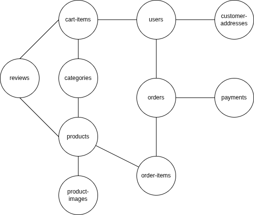

# 🛍️ E-Commerce Platform - Laravel + React

> A full-featured e-commerce platform built with Laravel 10 and React, demonstrating MVC architecture, RESTful API design, and modern web development practices.

---

## 🎯 About The Project

This is a college project showcasing a complete e-commerce platform built using **Laravel framework** with **React frontend** and **MVC architecture**. The project demonstrates understanding of:

- ✅ Model-View-Controller (MVC) design pattern
- ✅ RESTful API development
- ✅ Database relationships and migrations
- ✅ Authentication & Authorization (Laravel Breeze)
- ✅ Modern PHP frameworks with React SPA
- ✅ Clean code practices


### **Learning Journey**

This is the framework-based version of my e-commerce project. I also currently building a [vanilla PHP version](https://github.com/Saad05-dev/ecommerce-project-vanilla-php) to understand core concepts before using frameworks.

---

## 📋 Project Overview

### Core Features

- **User Management** - Registration, login, and profile management
- **Product Catalog** - Browse products with categories
- **Shopping Cart** - Works for both guests (session) and authenticated users
- **Order System** - Complete order processing and tracking
- **Reviews & Ratings** - Customers can rate and review products
- **Address Management** - Shipping and billing addresses

### Use Cases

| Actor | Action |
|-------|--------|
| 👤 Visitor | Can browse products without an account |
| 📝 User | Can register and create a profile |
| 🛒 Customer | Can add products to cart |
| 📦 Customer | Can place orders and track status |
| ⭐ Customer | Can leave reviews on purchased products |

### Database Schema

The database follows a relational model with the following main entities:



> *See full SQL schema in [`database/sql/laravel_ecommerce.sql`](database/sql/laravel_ecommerce.sql)

### Class Diagram


---

## 🛠️ Tech Stack

### Backend
- **Framework:** Laravel 10.x
- **Language:** PHP 8.1+
- **Database:** MySQL 8.0
- **Authentication:** Laravel Breeze with React
- **ORM:** Eloquent

### Frontend
- **Framework:** React 18.x
- **Build Tool:** Vite
- **CSS Framework:** Tailwind CSS 3.x
- **HTTP Client:** Axios
- **Routing:** React Router / Inertia.js

### Tools & Services
- **Package Manager:** Composer (PHP) & npm (JavaScript)
- **Version Control:** Git
- **Code Editor:** VS Code

---

## 📋 Prerequisites

Make sure you have the following installed:
- PHP 8.1+
- Composer
- Node.js 16+ and npm
- MySQL 8.0
- Git

---

## 🚀 Installation & Setup

## Step 1: Clone the Repository
```bash
git clone git@github.com:Saad05-dev/ecommerce-laravel.git
```

## Step 2: Navigate to repository and install dependencies
```bash
cd ecommerce-laravel
```

## Install PHP dependencies
```bash
composer install
```

## Install JavaScript dependencies
```bash
npm install
```

## Step 3: Environment Configuration

**Copy the environment file**
```bash
cp .env.example .env
```

# Generate application key
```bash
php artisan key:generate
```

## Step 4: Database Setup

1. Create a MySQL database 
    in terminal run:
```bash
        mysql -u root -p
        CREATE DATABASE ecommerce_db;
        exit;
```
2. Configure database in .env file 
```bash
    DB_CONNECTION=mysql
    DB_HOST=127.0.0.1
    DB_PORT=3306
    DB_DATABASE=ecommerce_db
    DB_USERNAME=your_username
    DB_PASSWORD=your_password
```
3. Run Laravel migrations FIRST (creates base tables)
 ```bash
    php artisan migrate
```
## Step 5: Start the Development Servers
```bash
    npm run dev
```
**open another terminal and run:**
```bash
    php artisan serve
```